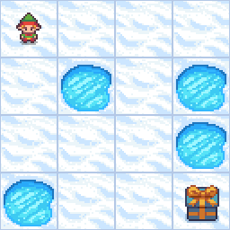

# Q-Learning 알고리즘으로 FrozenLake 문제 해결

이 문서는 Gymnasium의 [FrozenLake-v1](https://gymnasium.farama.org/environments/toy_text/frozen_lake/) 환경에서 Q-Learning 알고리즘을 사용하여 에이전트를 학습시키는 과정을 설명합니다.

## 1. Q-Learning 이란?

Q-Learning은 환경과의 상호작용을 통해 특정 상태(State)에서 특정 행동(Action)을 취하는 것의 가치(Q-value)를 학습하는 모델 프리(Model-free), 오프 폴리시(Off-policy) 강화학습 알고리즘입니다. 에이전트는 Q-테이블을 업데이트하며 최적의 정책(Policy)을 찾아나갑니다. Q-value 업데이트 규칙은 다음과 같습니다.

$Q(s, a) \leftarrow Q(s, a) + \alpha [r + \gamma \max_{a'} Q(s', a') - Q(s, a)]$

여기서:
- $s$: 현재 상태
- $a$: 현재 행동
- $r$: 보상
- $s'$: 다음 상태
- $a'$: 다음 상태에서 가능한 행동
- $\alpha$: 학습률 (Learning Rate)
- $\gamma$: 할인율 (Discount Factor)

## 2. FrozenLake 환경

FrozenLake 환경은 에이전트가 얼어붙은 호수 위를 미끄러지지 않고 시작 지점(S)에서 목표 지점(G)까지 도달해야 하는 간단한 그리드 월드 환경입니다. 중간에는 구멍(H)이 있어 빠지면 에피소드가 종료됩니다.

- **상태 공간 (State Space)**: 그리드의 각 칸 (예: 4x4 맵의 경우 16개 상태)
- **행동 공간 (Action Space)**: 상, 하, 좌, 우 (0: Left, 1: Down, 2: Right, 3: Up)
- **보상 (Reward)**:
    - 목표 지점(G)에 도달: +1
    - 그 외 모든 경우 (구멍(H)에 빠지거나, 얼음(F) 위를 이동): 0
- **환경 특성**: 기본적으로 '미끄러운(slippery)' 환경으로 설정되어 있어, 에이전트가 선택한 행동이 아닌 다른 방향으로 이동할 수 있습니다.

## 3. 학습 결과 시각화

아래 GIF는 학습된 Q-테이블을 사용하여 FrozenLake 환경에서 에이전트가 목표 지점('G')에 도달하는 과정을 보여줍니다.




## 4. 주요 파일 구성

현재 `Q_learning` 디렉토리 내의 주요 파일은 다음과 같습니다:

* `mvp.ipynb`: FrozenLake 환경에서 Q-learning 알고리즘을 실행하고 학습 결과를 시각화하는 Jupyter Notebook 파일입니다. **FrozenLake 환경에 대한 주요 실행 및 데모 파일입니다.**
* `main.py`: (향후 다른 환경 또는 일반화된 Q-learning 실행을 위한 메인 스크립트 - 현재 개발/수정 중)
* `train.py`: (학습 로직을 담당하는 모듈 - 현재 개발/수정 중)
* `test.py`: (학습된 모델의 테스트 로직을 담당하는 모듈 - 현재 개발/수정 중)
* `utils.py`: (보조 함수 및 유틸리티 모음 - 현재 개발/수정 중)
* `Readme.md`: 현재 보고 계신 이 파일로, Q-learning 구현에 대한 설명을 담고 있습니다.


## 5. 사용된 하이퍼파라미터

학습에 사용된 주요 하이퍼파라미터는 다음과 같습니다. 최적의 값은 환경이나 실험 설정에 따라 달라질 수 있습니다. `mvp.ipynb`에서 사용된 값을 제공합니다. `main.py`의 값과 차이가 있으며, 파일 내에서 확인할 수 있습니다.

* **학습률 (Alpha, `alpha`)**: 0.8
* **할인율 (Gamma, `gamma`)**: 0.95
* **총 에피소드 수 (`n_episodes`)**: 2000
* **Epsilon (탐험율, `epsilon`)**:
    * 초기값 (`initial_epsilon`): 1.0
    * 최소값 (`min_epsilon`): 0.01
    * 감소율 (`epsilon_decay_rate`): 0.995
* **에피소드 당 최대 스텝 수 (`max_steps`)**: 100

## 6. 실행 방법

FrozenLake 환경에 대한 Q-learning 학습 및 테스트는 `mvp.ipynb` 파일을 통해 진행할 수 있습니다. Google Colab 혹은 jupyter notebook에서 진행하시기 바랍니다.

`main.py`의 Q-learning 학습을 실행하려면 다음 명령어를 사용하세요
```bash

python src/algorithms/Q_learning/main.py
```